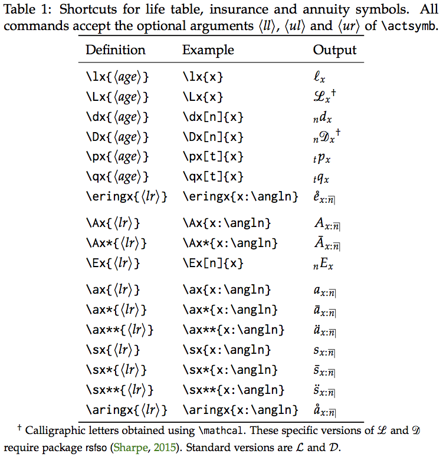

Actuaries denote various quantities of life contingencies like present
values of life insurances and life annuities, annual premiums, or
reserves using a whole array of symbols. The highly descriptive, yet
compact, notation is subject of an
[international standard](https://en.wikipedia.org/wiki/Actuarial_notation)
since 1898.

Actuarial notation is characterized by auxiliary symbols positioned in
subscript and superscript on both sides of a principal symbol,
something notoriously difficult to achieve consistently in LaTeX. It
also requires some unusual symbols not found in standard mathematics
packages, like the *angle* denoting a duration in insurance and
annuity symbols.

[**actuarialsymbol**](https://ctan.org/pkg/actuarialsymbol) and
[**actuarialangle**](https://ctan.org/pkg/actuarialangle) are two LaTeX
packages providing facilities to compose actuarial symbols of life
contingencies and financial mathematics. The packages are actively
maintained, widely available through the
[Comprehensive TeX Archive Network](https://ctan.org) (CTAN)
and part of [TeX Live](https://tug.org/texlive) and
[MiKTeX](https://miktex.org).

## Alternatives

Many authors use ad hoc constructions like `{}_tA_x` to put subscripts
and superscripts in front of a symbol. This notation is obviously a
nightmare to parse mentally and the source code has little
relationship to the actual significance of the symbol. However, the
worst drawback to this approach is probably that there is no way to
ensure that subscripts and superscripts on either side of the
principal symbol are aligned. Try something like `{}_tA_x^{(m)}`, for
example.

Package [**mathtools**](https://ctan.org/pkg/mathtools) provides a
command `\prescript` to put a subscript or superscript on the left of
an argument. This works well when the argument (or principal symbol)
has sub- and superscripts on all four corners, but otherwise the
auxiliary symbols may end up at different heights.

Finally, various packages tailored for specific disciplines offer the
possibility to position sub and superscripts on the left, for example
[**tensor**](https://ctan.org/pkg/tensor) for tensors or
[**mhchem**](https://ctan.org/pkg/mhchem) for isotopes.

## Features

### actuarialangle

- Typesetting of a nice looking [angle symbol](images/angln.png) with command
  `\angl` (and shortcuts `\angln`, `\anglk` and `\anglr` for common
  cases).
- Package option to insert a thin or thick space between the symbol
  under the angle and the right descender.
- Typesetting of an [over angle bracket](images/overanglebracket.png) used to emphasize joint
  status in life contingencies symbols with command `\overanglebracket`.
  The rule thickness and spacing relative to the statuses underneath
  the bracket match those of the angle symbol.

### actuarialsymbol

- Composition of an arbitrary actuarial symbol with the generic
  command `\actsymb`. The command has mandatory arguments for the
  principal symbol and for the auxiliary symbol in the lower right
  corner. Auxiliary symbols in the lower left, upper left and upper
  right corners are optional. Subscripts and superscripts are
  vertically aligned and positioned following TeX's defaults.

- Shortcuts to easily and consistently compose most common actuarial
  symbols of life contingencies. The nomenclature clearly identifies
  the symbol being typeset (e.g. `\Ax`, `\ax`, `\sx`) and makes clever
  use of the star (e.g. `\Ax*` for `\bar{A}` and `\ax**` for
  `\ddot{a}`). See [below](#peek) for a sneak peek and the
  [package documentation](http://mirrors.ctan.org/macros/latex/contrib/actuarialsymbol/actuarialsymbol.pdf)
  for the complete list of shortcuts.

- Extended syntax of `\actsymb` and shortcuts to typeset symbols for
  premiums, reserves and paid-up insurance.

- Facilities to define new shortcuts that automatically gain `*` and
  `**` variants.

- Typesetting of two-letter actuarial symbols with command
  `\twoletsymb` and a number of shortcuts for the most common
  combinations like (*IA*) and (*DA*).

- Positioning of [precedence numbers](images/precedence.png) (or
  decrement order) above or below statuses of multiple lives contracts
  with the generic commands `\nthtop` and `\nthbottom`. Shortcuts for
  first, second and third precedence order are available.

  By default, commands `\nthtop` and `\nthbottom` (are corresponding
  shortcuts) position precedence numbers at a constant distance from
  the corresponding status. Starred versions of the commands will
  rather position the numbers at a fixed height. A package option
  allows to switch the default behavior.

- Appendix A of the
  [package documentation](http://mirrors.ctan.org/macros/latex/contrib/actuarialsymbol/actuarialsymbol.pdf)
  lists the commands to typeset a large selection of life
  contingencies symbols with **actuarialsymbol** and
  **actuarialangle** loaded.

##  Sneak peek

The excerpt from the package documentation below lists the shortcut
for life table, insurance and annuity symbols.

> 

## Source code

The source code of
[actuarialangle]({{ site.github.owner_url }}/actuarialangle) and
[actuarialsymbol]({{ site.github.owner_url }}/actuarialsymbol) is hosted
on GitHub. You may file bug reports, comments or feature requests
there.

Both packages are licensed under the
[LaTeX Project Public License](http://mirrors.ctan.org/macros/latex/base/lppl.txt).

## Authors

David Beauchemin ([davebulaval]({{ site.github.hostname }}/davebulaval)) and
Vincent Goulet ([vigou3]({{ site.github.owner_url}})),
[École d'actuariat](https://www.act.ulaval.ca),
[Université Laval](https://ulaval.ca).
